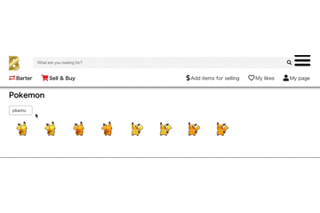

axiosを使ってapiから画像を取得して画面に表示してみる
===

完成イメージ
---



### 1. axiosのインストール

```bash
npm install axios
```

or

```
yarn add axios

```

### 2. サンプルページ作成

- `src/pages/Pokemon.js`を作成
- `App.js`にルーティングを追加

```js
import Pokemon from './pages/Pokemon'
// ...

<Switch>
  <Route path='/header'>
    <Header />
  </Route>
  <Route path='/product-detail'>
    <ProductDetai />
  </Route>
  <Route path='/regist-product'>
    <RegistProduct />
  </Route>
  <Route path='/pokemon'> // ここに追加
    <Pokemon />
  </Route>
  <Route path='/'>
    <Index />
  </Route>
</Switch>
```

### 3. `Pokemon.js`の実装

> 途中までのソースを貼り付けています。続きを実装してみてください。


```js
import React, { useState, useEffect } from 'react'
import axios from 'axios'
import styled from 'styled-components'

import Wrapper from '../components/Wrapper'
import H2 from '../components/HeadlineLevel2'

// https://pokeapi.co/api/v2/pokemon/pikachu
const URI = 'https://pokeapi.co/api/v2/pokemon'

const findBy = async (name = 'pikachu') => {
  // const monster = await
  // return monster.data
}

const defaultSprites = {
  back_default: "https://raw.githubusercontent.com/PokeAPI/sprites/master/sprites/pokemon/back/25.png",
  back_female: "",
  back_shiny: "",
  back_shiny_female: "",
  front_default: "",
  front_female: "",
  front_shiny: "",
  front_shiny_female: "",
}

const UL = styled.ul`
display: flex;
`

const Select = styled.select`
display: block;
margin-top: 24px;
color: #444;
padding: .6em 1.4em .5em .8em;
box-sizing: border-box;
border: 1px solid #aaa;
box-shadow: 0 1px 0 1px rgba(0,0,0,.04);
border-radius: .5em;
appearance: none;
background-color: #fff;
`

const Pokemon = props => {

  useEffect(() => {

  }, [])

  const ListItem = () => (
    <React.Fragment>
      {/* <li></li> */}
    </React.Fragment>
  )

  return (
    <React.Fragment>
      <Wrapper>
        <H2>Pokemon</H2>
        <Select>
          <option value="pikachu">pikachu</option>
          <option value="fearow">fearow</option>
          <option value="nidorino">nidorino</option>
          <option value="rhyhorn">rhyhorn</option>
        </Select>
        <UL>
          <ListItem />
        </UL>
      </Wrapper>
    </React.Fragment>
  )
}

export default Pokemon
```

### ヒント

- まずはピカチュウを表示させましょう
- ユーザーの操作で変わるものは何かを考え、それを`useState`で管理しょましょう
- `findBy`の中でaxiosを実行します。 **`findBy`は`async`なので、`return`で受け取れるのは何か...**
- サンプルapi: [https://pokeapi.co/api/v2/pokemon/pikachu](https://pokeapi.co/api/v2/pokemon/pikachu)
- プルダウン(`<select>`)変更時のイベントは`<Select onChange={e => setMonsterName(e.target.value)}>`のようにすれば選択された`value`の値が取得できます。
